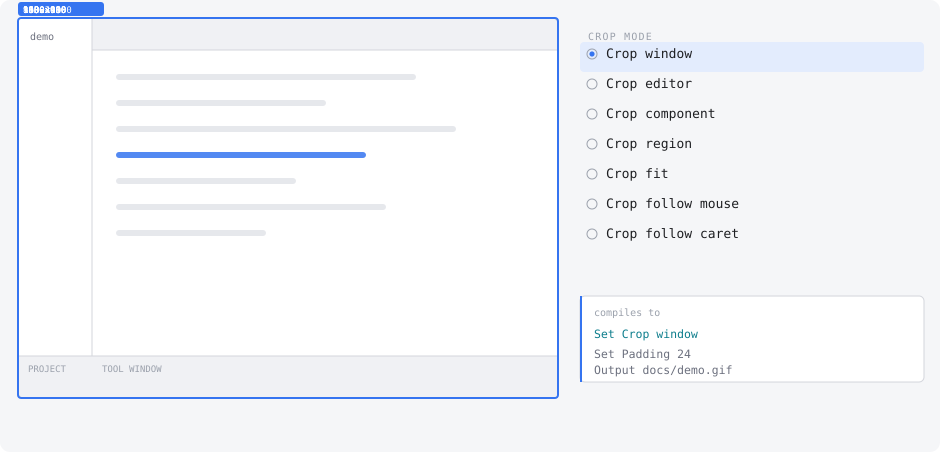
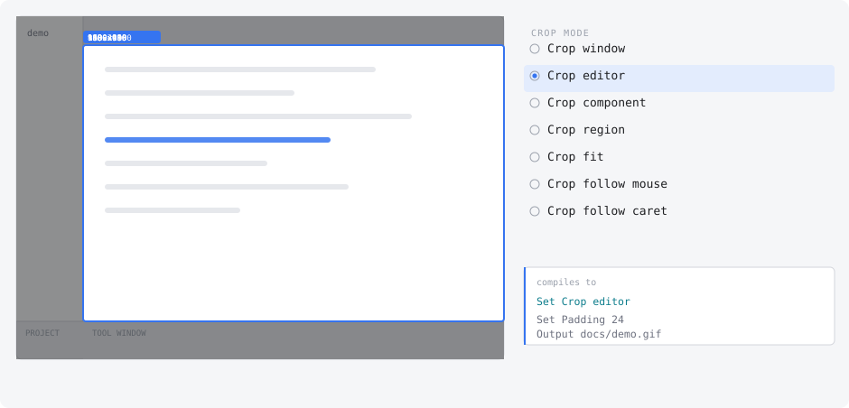
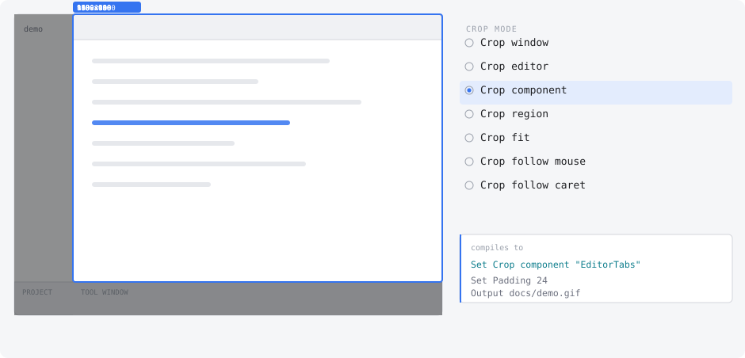
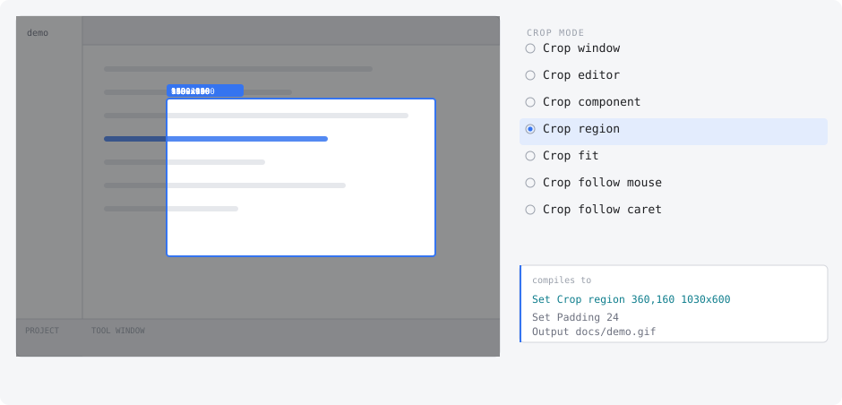
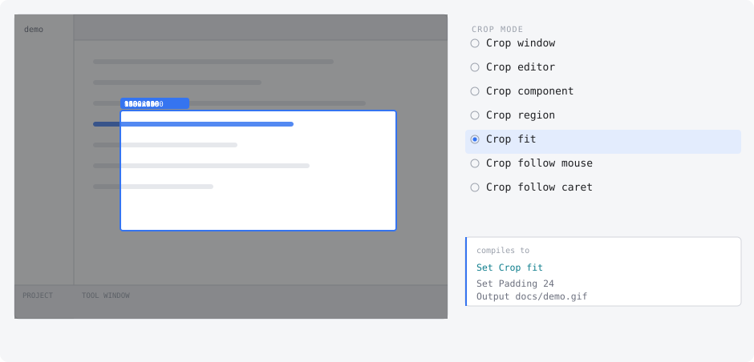
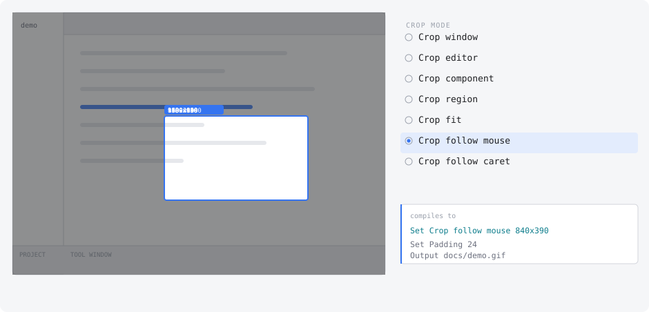
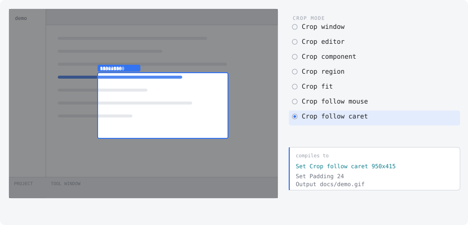

# jetbrains-plugins

My JetBrains IDE plugins.

## Install

Add this URL under **Settings > Plugins > gear icon > Manage Plugin Repositories**, then install any plugin below from the Marketplace tab; they self-update from then on.

```
https://raw.githubusercontent.com/asafjac/jetbrains-plugins/main/updatePlugins.xml
```

Requires WebStorm or IDEA Ultimate.

## Featured plugins

### Demo Driver

Records IDE demos from a script, so a demo is re-recorded on demand instead of performed by hand. Press Record in the **Demo Driver** tool window, use the IDE normally, and it writes the script for you; ffmpeg is downloaded on first use if you do not have it.

<picture>
  <source media="(prefers-color-scheme: dark)" srcset="docs/demo-driver-dark.svg">
  
</picture>

Seven ways to frame the shot. Every control writes one line of tape, so anything you can click, a script or an agent can write.

<picture>
  <source media="(prefers-color-scheme: dark)" srcset="docs/framing-dark.svg">
  
</picture>

Or step through them yourself:

<details>
<summary><code>Set Crop window</code></summary>

The whole IDE frame. Nothing to configure, nothing to break.

<picture>
  <source media="(prefers-color-scheme: dark)" srcset="docs/crop-window-dark.svg">
  
</picture>

</details>

<details>
<summary><code>Set Crop editor</code></summary>

Just the editor component, resolved fresh at run time.

<picture>
  <source media="(prefers-color-scheme: dark)" srcset="docs/crop-editor-dark.svg">
  
</picture>

</details>

<details>
<summary><code>Set Crop component "EditorTabs"</code></summary>

Any named IDE part, so one tape frames correctly on a machine whose layout differs.

<picture>
  <source media="(prefers-color-scheme: dark)" srcset="docs/crop-component-dark.svg">
  
</picture>

</details>

<details>
<summary><code>Set Crop region 360,160 1030x600</code></summary>

Exact pixels, and the one mode that needs redoing when anything moves.

<picture>
  <source media="(prefers-color-scheme: dark)" srcset="docs/crop-region-dark.svg">
  
</picture>

</details>

<details>
<summary><code>Set Crop fit</code></summary>

The bounding box of the tape's own targets, plus padding. Nothing on screen the demo never touches.

<picture>
  <source media="(prefers-color-scheme: dark)" srcset="docs/crop-fit-dark.svg">
  
</picture>

</details>

<details>
<summary><code>Set Crop follow mouse 840x390</code></summary>

A fixed viewport tracking the pointer. Big text in a small file, at the cost of spatial bearings.

<picture>
  <source media="(prefers-color-scheme: dark)" srcset="docs/crop-follow-mouse-dark.svg">
  
</picture>

</details>

<details>
<summary><code>Set Crop follow caret 950x415</code></summary>

The same, tracking the caret. Steadier, since the pointer wanders during a glide.

<picture>
  <source media="(prefers-color-scheme: dark)" srcset="docs/crop-follow-caret-dark.svg">
  
</picture>

</details>

### Registry Navigator

In a codebase where `<FooRegistry.qux.Baz />` is resolved by a class hierarchy, Go to Declaration lands on the base getter and stops; this jumps straight to every implementation's real component.

<table>
<tr>
<th align="left">Before: four hops</th>
<th align="left">After: one click</th>
</tr>
<tr>
<td width="50%"></td>
<td width="50%"></td>
</tr>
</table>

Changes per plugin are in [CHANGELOG.md](CHANGELOG.md).

## Repo

```
plugins/<name>/    one plugin each
buildSrc/          shared build conventions
demo/              dependency-free fixture, plus tapes in demo/shots/
docs/              recordings
```

Add a plugin: create `plugins/my-plugin/build.gradle.kts` with `plugins { id("jbplugins.intellij-plugin") }` and a version, then `include("plugins:my-plugin")` in [settings.gradle.kts](settings.gradle.kts).

Build with `./build.sh` (or `build.cmd` on Windows), which finds a JDK from any installed
JetBrains IDE so nothing has to be installed first. Add a task to pass it through:
`./build.sh runIde` opens a sandbox IDE with the fixture loaded.
