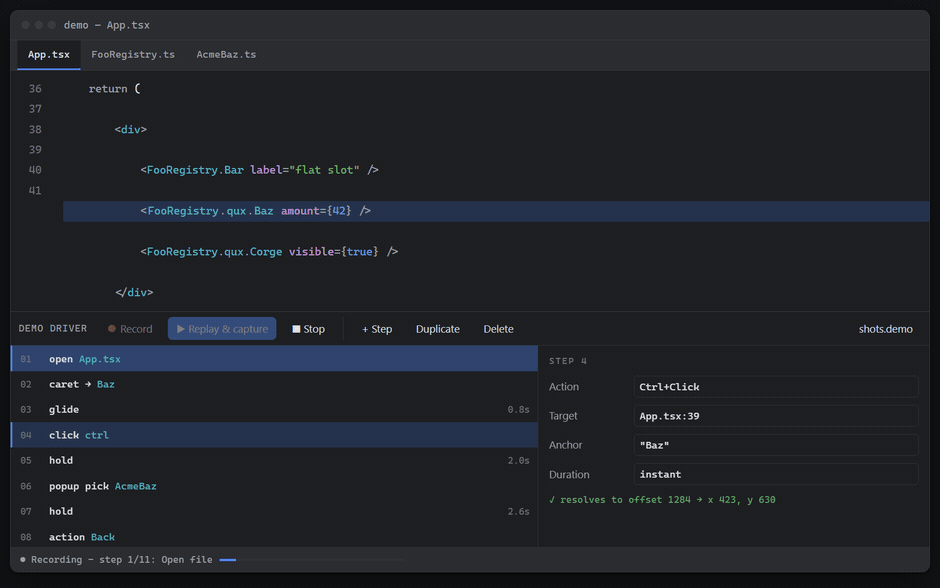
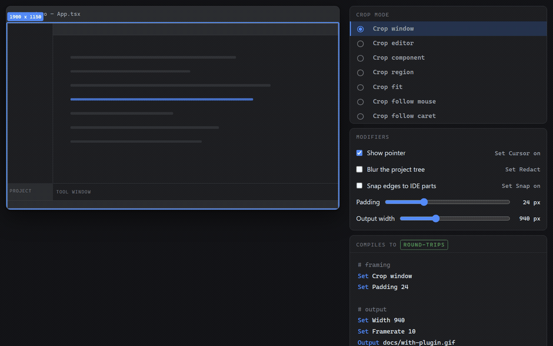
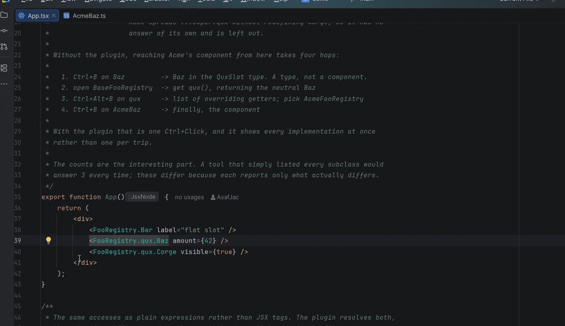
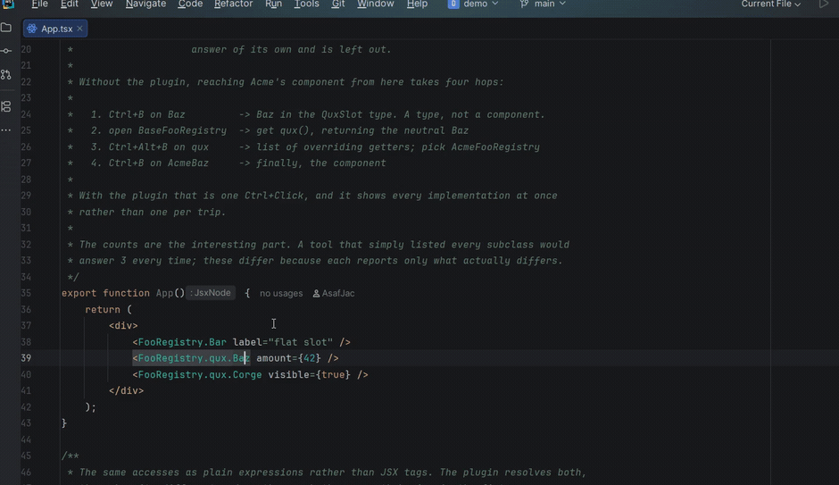

# jetbrains-plugins

My JetBrains IDE plugins.

## Install

Add this URL under **Settings > Plugins > gear icon > Manage Plugin Repositories**, then install any plugin below from the Marketplace tab; they self-update from then on.

```
https://raw.githubusercontent.com/asafjac/jetbrains-plugins/main/updatePlugins.xml
```

Requires WebStorm or IDEA Ultimate.

## Featured plugins

### Demo Driver

Records IDE demos from a script, so a demo is re-recorded on demand instead of performed by hand.



Seven ways to frame the shot. Every control writes one line of tape, so anything you can click, a script or an agent can write.



### Registry Navigator

In a codebase where `<FooRegistry.qux.Baz />` is resolved by a class hierarchy, Go to Declaration lands on the base getter and stops; this jumps straight to every implementation's real component.

<table>
<tr>
<th align="left">Before: four hops</th>
<th align="left">After: one click</th>
</tr>
<tr>
<td width="50%"></td>
<td width="50%"></td>
</tr>
</table>

## Repo

```
plugins/<name>/    one plugin each
buildSrc/          shared build conventions
demo/              dependency-free fixture, plus tapes in demo/shots/
docs/              recordings
```

Add a plugin: create `plugins/my-plugin/build.gradle.kts` with `plugins { id("jbplugins.intellij-plugin") }` and a version, then `include("plugins:my-plugin")` in [settings.gradle.kts](settings.gradle.kts).

Build with `./build.sh` (or `build.cmd` on Windows), which finds a JDK from any installed
JetBrains IDE so nothing has to be installed first. Add a task to pass it through:
`./build.sh runIde` opens a sandbox IDE with the fixture loaded.
